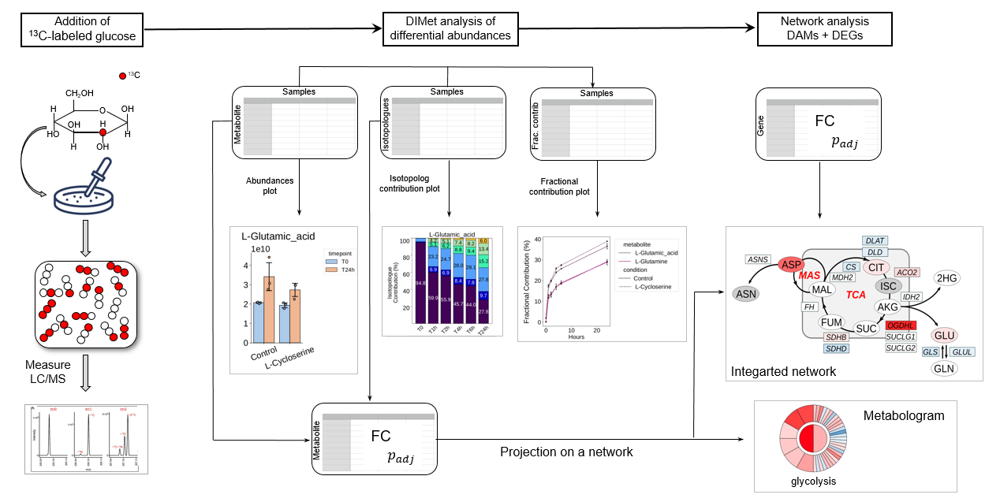

# DIMet

[](https://github.com/johaGL/dimet/blob/main/LICENSE)

[](https://www.cbib.u-bordeaux.fr/)

## DIMet: Differential Isotope-labeled targeted Metabolomics
----------------------------
**DIMet** is a bioinformatics pipeline for differential analysis of isotopic targeted labeling data.

Closely related to conventional metabolomics, stable isotope-resolved metabolomics (SIRM) uses an isotope labeled substrate to track specific pathways. From these data, it is possible to compute differences in isotope enrichment, changes in the labeling pattern, or differences in the contribution of nutrients to a metabolite pool, yielding knowledge of the metabolic state [1, 2]. Targeted metabolomics, when combined to transcriptomics, allows to better characterize perturbations within the pathways of interest.  

DIMet supports the analysis of full metabolite abundances and isotopologue contributions, and allows to perform it either in the differential comparison mode or as a time-series analysis. As input, the DIMet accepts three types of measures: a) isotopologues’ contributions, b) fractional contributions, c) full metabolites’ abundances. Specific functions process each of the three types of measures separately:  




### Requirements
You need a UNIX system, with conda or miniconda3 installed, see [https://docs.conda.io/projects/conda/en/latest/user-guide/install/index.html](https://docs.conda.io/projects/conda/en/latest/user-guide/install/index.html).

Then clone DIMet repository in your `$HOME` directory, and set the virtual environment by running (from terminal):
```
cd $HOME
git clone 
conda env create --file DIMet/dimet.yml
conda activate dimet 
```

To visualize the help menu:
```
python3 DIMet --help
```

Take both examples outside of DIMet:
```
cd $HOME
cp -r DIMet/example1 .
cp -r DIMet/example2 .
```

Run and explore the examples, before trying your own data and configuration files. 
Perform a differential analysis using the example1/:
```
python3 DIMet --mode prepare --config example1/configs/cc.yml --mywdir example1 
python3 DIMet --mode diffabund --config example1/configs/cc.yml --mywdir example1 
```

Sections *Prepare your analysis* and *Run your analysis* will guide you step by step.

## Prepare your analysis

### Create your project folder
Your project folder must be completely outside of DIMet, with the minimal required structure : 
```
MYPROJECT_MYSUFFIX
├── configs <-- your configuration file 
│   └── config_MYSUFFIX.yml
├── data
│   ├── Abundances_MYSUFFIX.tsv
│   ├── CorrectedIsotopologues_MYSUFFIX.tsv
│   └── metadata_MYSUFFIX.csv
└── results
```

The `results/` is an empty folder, where your results will be written.

The `data/` folder contains:
- The Isotopologues Contributions file
- The total metabolites Abundances file 
- A metadata, describing the samples

For details about appropriate formatting these three types of files, see Notes.

### Create your configuration file

The `configs` folder contains all your "instructions" for running the analysis. 
These instructions must be written in a `.yaml` file.
Example of such a file (any word(s) precedded by `#` is ignored): 
```
mywdir : "~/example1/" # the full path of MYPROJECT
datadi : "data/"
extrulist_fi : "mets_toexclude.csv" 

names_compartments : # set abreviations (better), or rewrite the same compartment names
  Cell_extracts : "cell"
  Medium : "med"
  
namesuffix : "cycloser"
metadata_fi : "metadata_cycloser.csv"

# global configuration 
levelstime : ["T0", "T1h","T2h", "T4h","T6h","T24h"]
conditions : ["Control", "L-Cycloserine"] # first must be control
name_abundances : "rawAbundances"
name_isotopologue_contribs : "CorrectedIsotopologues"

# Differential Analysis configuration
max_m_species : 4
whichtest : "Tt"
technical_toexclude : ['13C5-D5-15N_Glutamic_acid', 'Myristic_acid_d27']

newcateg : ["condition", "timepoint"]  # example 'Control_T0'

contrasts : [ ['L-Cycloserine_T0', 'Control_T0'], # for each pair,last must be control
              ['L-Cycloserine_T6h', 'Control_T6h'],
              ['L-Cycloserine_T24h', 'Control_T24h'] ]
```

See Notes for a detailed explanation, which will help you to write down your own configuration file.
Please check the full configuration files located in both example folders, which are provided with our DIMet pipeline.
These files give you nice examples of how to include the parameters for `timeseriesplots` and `abundplots` in your configuration file. 

## Run your analysis

DIMet `--mode` options are:
- `prepare` : need to be executed before any other type of analysis, because it checks your input files and creates tmp/ folder with clean, compartment specific versions of your input files.
- `diffabund` : differential abundances of metabolites and isotopologues
- `timeseriesplots` : isotopologues' stacked bars and fractional contributions line-plots
- `abundplots` : comparative bars of isotopologue's and total metabolites abundances

So the mode `prepare` is compulsory to be the first, the others can be made in any desired order.

```
python3 DIMet --mode prepare --config example1/configs/cc.yml --mywdir example1 
python3 DIMet --mode diffabund --config example1/configs/cc.yml --mywdir example1 
```

### Notes

**Regarding the project folder**

MYSUFFIX is just a short word describing your experiment.

You will notice in the examples provided by our pipeline, that there is also a folder 'smpls_raw/' which is an example of data as received by the metabolomics platform, but that has been properly formatted:
- Rows must be metabolites, or the isotopologues.
- Columns must be the samples. 
- A correct samples naming: unambiguous and the most detailed possible.
All three requirements must be assured manually or by custom bioiformatic scripts ('example1/smpls\_raw/formatter\_be.py' is such an example). 

**Regarding the metadata file**

Here the first lines of a metadata table, which must be saved in a .csv (comma delimited) file : 

| sample            | timepoint | condition | Hours | short_comp |
|-------------------|-----------|-----------|-------|------------|
| Control\_cell\_T0-1 | T0        | Control   | 0     | cell       |
| Control\_cell\_T0-2 | T0        | Control   | 0     | cell       |
| Control\_cell\_T0-3 | T0        | Control   | 0     | cell       |

Column names in metadata must be exactly: sample, timepoint, condition, short\_comp.
Include a column Hours if desiring to obtain FracContribs line-plots.
Please do not use underscore `_` inside any of the columns other than 'sample' ( 'T\_0' not! , 'Control\_oxy' not!). 
DIMet uses underscore as a separator to join and split terms, depending on the needs.
The 'sample' column in metadata must match perfectly with the column names of your .tsv files
The column ordering is free. 

**Regarding the configuration file**

The yaml example above has two sections: 

*global configuration*:
* `extrulist_fi` : a file which contains metabolites that you decided to exclude owing to bad quality or technical issues. Comma delimited .csv
* `names_compartments` : if available, fill them all. If no information about compartment, set to `cell : "cell"`
* `namesuffix` : the same short word to describe your experiment that you used (MYSUFFIX) for file names
* `levelstime` : the order of your time points
* `conditions` : your conditions or genotypes or treatments, first must be the control
* `name_abundances` and `name_isotopologue_contribs` : The names of the files must be given without suffix nor extension

*Differential analysis configuration*:
* `max_m_species` : in the case of isotopologues the maximal n+x species to be subjected to comparison
* `which_test` : we support currently the parametric t-test "Tt" and the non-parametric Wilcoxon-Mann-Whitney test "MW".
By default, we apply Benjamini-Hochberg procedure to correct for multiple testing.
* `technical_toexclude` : optional, just if any internal technical molecule remains which was not excluded before
* `newcateg` : column that is a combination of 2 or more metadata categories. 
	The new category thus generated, is ready for comparison to its counterpart/opposite, example :
		
		- Control (a condition) combined with T0 (a timepoint), yields Control_T0.  
		
		- L-Cyclo (another condition) combined with T0 (same timepoint) yields L-Cyclo_T0.
		
		
		So now, we are able to compare L-Cyclo_T0 against Control_T0.
You only have to set the columns to combine to create that new category.
		
* `contrasts` : all your comparisons to be performed, in the form of a list of pairs, where each pair is a comparison.
	For each pair, the last element must be the control.	

A very common error is to use 'tab' to create your indentations in the yaml file, but this can make the file unreadable. To create indentations, use spaces instead.

**Files' extensions**:

The files .csv are comma separated, whereas the .tsv are tabular delimited.
Excel files are not allowed, as sheets organization is too customized. Please imitate the style of the examples, using .tsv files (for isotopologues contributions and metabolites abundances) , and .csv files (for metadata and list of metabolites to exclude)

### References

[1] Bruntz, R. C., Lane, A. N., Higashi, R. M., & Fan, T. W. M. (2017). Exploring cancer metabolism using stable isotope-resolved metabolomics (SIRM). Journal of Biological Chemistry, 292(28), 11601-11609.

[2] Buescher, J. M. et al. A roadmap for interpreting (13)C metabolite labeling patterns from cells. Curr Opin Biotechnol 34, 189–201, https://doi.org/10.1016/j.copbio.2015.02.003 (2015).


## things to do
- go to settings-> action -> enable repo modification

