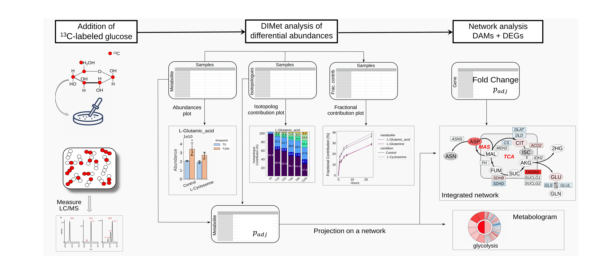

# DIMet

[](https://github.com/johaGL/dimet/blob/main/LICENSE)

[](https://www.cbib.u-bordeaux.fr/)

## DIMet: Differential Isotope-labeled targeted Metabolomics
----------------------------
**DIMet** is a bioinformatics pipeline for differential analysis of isotopic targeted labeling data.

Closely related to conventional metabolomics, stable isotope-resolved metabolomics (SIRM) uses an isotope labeled substrate to track specific pathways. From these data, it is possible to compute differences in isotope enrichment, changes in the labeling pattern, or differences in the contribution of nutrients to a metabolite pool, yielding knowledge of the metabolic state [1, 2]. Targeted metabolomics, when combined to transcriptomics, allows to better characterize perturbations within the pathways of interest.  

DIMet supports the analysis of full metabolite abundances and isotopologue contributions, and allows to perform it either in the differential comparison mode or as a time-series analysis. As input, the DIMet accepts three types of measures: a) isotopologues’ contributions, b) fractional contributions, c) full metabolites’ abundances. Specific functions process each of the three types of measures separately.

DIMet is intended for downstream analysis in corrected tracer data (corrected for the presence of natural isotopologues). Make sure you that you or your platform provides the output of the correction before using our DIMet pipeline. 




##### Table of Contents  
[Requirements](###Requirements)  
[Run the Analysis (fast guide):](#Run\ DIMet\ analysis)
- [Run a quick preparation](##Prepare)  
- [Get PCA(s)](##Get\ PCA(s))
- [Get plots](##Get\ plots)
- [Run Differential analysis](##Differential\ analysis)
- [..](##Get\ grams)
- 
[Into the deep](#Detailed\ guide)
- [Prepare in depth](##Prepare\ in\ depth)


## Requirements

You need a UNIX system, with conda or miniconda3 installed, see [https://docs.conda.io/projects/conda/en/latest/user-guide/install/index.html](https://docs.conda.io/projects/conda/en/latest/user-guide/install/index.html).

Then clone DIMet repository in your `$HOME` directory, and set the virtual environment by running (from terminal):
```
cd $HOME
git clone git@github.com:cbib/DIMet.git
conda env create --file DIMet/dimet.yml
conda activate dimet 
```
# Run DIMet Analysis

## Prepare
Three types of input are accepted, as xlsx files:
- IsoCor output .xlsx files
- Results provided by the VIB Metabolomics Expertise Center (El-Maven results are shaped in .xlsx files )  
- 'generic' .xlsx files.

Please see and use the examples we provide [here][examples/readme_examples.md]
Your data is expected to correspond to one of the three types we can process.  Attach to the example most suited to your data.

For example, if your data is 'generic',  do as shown [here][examples/toy3]
In any of the three possible scenario, you need two directories: 
1. data, containing:
    - the .xlsx file 
    - a file with the samples description, we call this the _metadata_
2. a folder with your configuration file (extension .yml)

Regarding the _metadata_, follow the toy examples. For more details check this [Metadata](###Metadata)

Regarding this .yml file we supply good examples that you can use as template, such  [this one][examples/toy1/analysis001/config-1-001.yml]. To double-check the modifications you can use a online editor, such as https://yamlchecker.com/, just copy-paste and edit!

Following the same example, take 

The prepare output consist of different dataframes (by compartment and by )

## Get PCA(s)

In construction

## Get plots

In construction

## Run a differential analysis

In construction

## Get grams

In construction

# Detailed guide

## Prepare in depth

To remind, your data is already the result of the procedure of correcting (the areas or intensities) for the presence of isotopologues in nature. There are several software options (for example, IsoCor, El-Maven, etc) to perform that correction. After correction, you can use our DIMet for the downstream analysis.

We provide advanced options for, check the help:
```
python -m DIMet.src.prepare --help
```
### for all users
You can:
- normalize by the amount of material (number of cells, tissue weight): setting the path to the file in your *.yml* configuration. The file must be like [this one][examples/toy2/data/nbcells-or-amountOfMaterial.csv], and the first column must contain the same names as in metadata 'former\_name'.
- normalize by an internal standard (present in your data) at choice: using the advanced option `--use_internal_standard`.


### Users having VIB results as input:
As shown in the example 'toy2' [here][],  give the names of the sheets in your excel file as indicated. 
You can use the advanced options (appearing as 'optional arguments' in the help menu). All these options can be modified. 
Our pipeline performs, by default:
- the subtraction of the means of the blanks across all metabolites' abundance for each sample.
- seting to NaN the values of abundance that are under the limit of detection (LOD).
- excluding metabolites whose abundance values across all samples are under LOD (excluded then from all tables by default).
- stomping fractions values to be comprised between 0 and 1 (some negative and some superior to 1 values can occur after )
- excluding metabolites


#### Users having generic data

We have created this option for those formats that are not the other two scenarios, so your data is expectd to be in the form of a .xlsx file with sheets (similar as in VIB results):
- sheets corresponding to isotopologue Proportions (when available) and isotopologue Absolute values must have isotopologues as columns and samples as rows.
- sheets corresponding to abundance and mean enrichment  must have metabolites as columns and samples as rows.

If you only have isotopologue Absolute values, but not the other tables, do not worry, we automatically generate them for you !

Feel free to contact us so we can help you to make your data a suitable input for DIMet.
 
### users having IsoCor results as input

Options regarding to detection limit (LOD) and blanks will not have any effect on the analysis. LOD is not provided in the data, and ame is true for blanks. 

All the other options have effect, those related to internal standard, amount of material, and isotopologues.
 
 
### Metadata

Here the first lines of the required metadata table, which must be a .csv (comma delimited) file : 

| sample            | timepoint | condition | timenum | short_comp  |  former_name |
|-------------------|-----------|-----------|-------|------------|--------------- |
| Control\_cell\_T0-1 | T0        | Control   | 0     | cell       | MCF001089_TD01 |
| Control\_cell\_T0-2 | T0        | Control   | 0     | cell       | MCF001089_TD02 |
| Control\_cell\_T0-3 | T0        | Control   | 0     | cell       |  MCF001089_TD03|

Column names in metadata must be exactly: sample, timepoint, condition, short\_comp, timenum and former\_name.
The column **former\_name** has the names of the samples **as given in your data**. If the samples' names in your data are already as you need, former\_name and sample can have the same values in the metadata table. 
Note: This permits you to obtain sample names that have meaning for your results.

The column *timenum* contains only the number of the timepoint (this means, without letters ("T", "t", "s", "h" etc) nor any other symbol) for example 2, 10, 100. Make sure your time points are in the same units.
 
 
 
 
### References

[1] Bruntz, R. C., Lane, A. N., Higashi, R. M., & Fan, T. W. M. (2017). Exploring cancer metabolism using stable isotope-resolved metabolomics (SIRM). Journal of Biological Chemistry, 292(28), 11601-11609.

[2] Buescher, J. M. et al. A roadmap for interpreting (13)C metabolite labeling patterns from cells. Curr Opin Biotechnol 34, 189–201, https://doi.org/10.1016/j.copbio.2015.02.003 (2015).

[3] Guyon J, Fernandez‐Moncada I, Larrieu C, M, Bouchez C, L, Pagano Zottola AC, Galvis J,...& Daubon T, (2022). Lactate dehydrogenases promote glioblastoma growth and invasion via a metabolic symbiosis, EMBO Molecular Medicine, e15343


## things to do
- go to settings-> action -> enable repo modification

