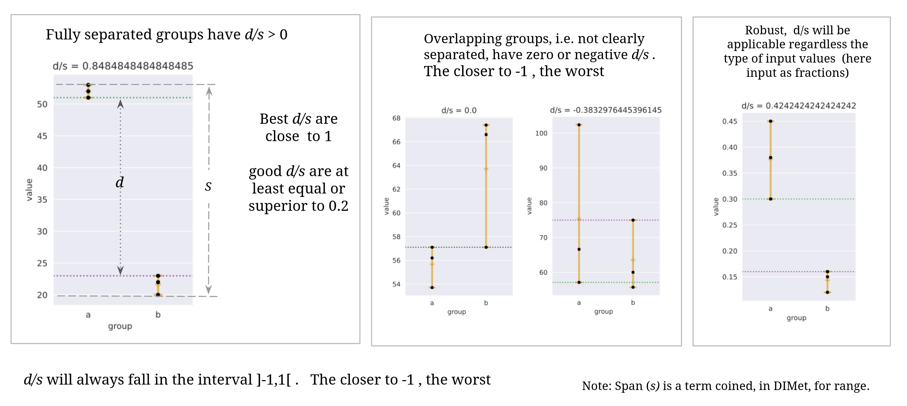

# DIMet

[](https://github.com/johaGL/dimet/blob/main/LICENSE)

[](https://www.cbib.u-bordeaux.fr/)

## DIMet: Differential Isotope-labeled targeted Metabolomics
----------------------------
**DIMet** is a bioinformatics pipeline for differential analysis of isotopic targeted labeling data.

Closely related to conventional metabolomics, stable isotope-resolved metabolomics (SIRM) uses an isotope labeled substrate to track specific pathways. From these data, it is possible to compute differences in isotope enrichment, changes in the labeling pattern, or differences in the contribution of nutrients to a metabolite pool, yielding knowledge of the metabolic state [1, 2]. Targeted metabolomics, when combined to transcriptomics, allows to better characterize perturbations within the pathways of interest.  

DIMet supports the analysis of full metabolite abundances and isotopologue contributions, and allows to perform it either in the differential comparison mode or as a time-series analysis. As input, the DIMet accepts three types of measures: a) isotopologues’ contributions, b) fractional contributions (also known as mean enrichment), c) full metabolites’ abundances. Specific functions process each of the three types of measures separately.

DIMet is intended for downstream analysis in corrected tracer data (corrected for the presence of natural isotopologues). Make sure you that the metabolomics platform provides you the output of the correction procedure before using our DIMet pipeline. 


##### Table of Contents  
[Requirements](#requirements)  

[Run the Analysis (fast guide)](#run-the-analysis-fast-guide)
- [Prepare](#prepare)  
- [Get PCA(s)](#get-pcas)
- [Run Differential analysis](#differential-analysis)
- [Get plots](#get-plots)
- [Get Metabolograms](#get-Metabolograms)
- 
[Detailed guide](#detailed-guide)
- [Prepare in depth](#prepare-in-depth)
- [Details regarding the
Differential Analysis](#details-regarding-the-differential-analysis)


## Requirements

You need a UNIX system, with conda or miniconda3 installed, see [https://docs.conda.io/projects/conda/en/latest/user-guide/install/index.html](https://docs.conda.io/projects/conda/en/latest/user-guide/install/index.html).

Then clone DIMet repository in your `$HOME` directory, and set the virtual environment by running (from terminal):
```
cd $HOME
git clone git@github.com:cbib/DIMet.git
conda env create --file DIMet/dimet.yml
conda activate dimet 
```

# Run the Analysis (fast guide)

## Prepare

DIMet `prepare` module is the first step of the entire downstream analysis offered by our pipeline. It is required to be performed before any of the other modules. Its execution takes only few seconds! 

### Input files

The prepare module requires :

1. The measures' files : in the "data/" folder
2. The metadata file : in the "data/" folder
3. The .yml configuration file : in the "analysis--/" folder

Regarding the measure's files, they consist of 4 tab-delimited .csv files, one by type of measure:

- metabolites' abundances ("abundance")
- labelled (carbon) fractional contributions or mean enrichment ("meanE\_or\_fracContrib")
- isotopologues' proportions ("isotopologue\_prop")
- isotopologues' absolute values ("isotopologue\_abs")

You can also run DIMet if you have all except the last type of measure. For specific scenarii see [Before prepare](#Some-words-before-`prepare`) and FAQ at the end of this document.

Regarding the "metadata", we explain it in detail in the section [Metadata](#the-metadata).

Regarding the .yml file, we supply examples that you can use as template, such  [this config.yml template](examples/toy1/analysis001/config-1-001.yml). To double-check your modifications there exist online editors, such as https://yamlchecker.com/, just copy-paste and edit!

### Execute `prepare` 

The examples serve to demonstrate how fast this module can be. Take toy1 example, copy and paste the entire toy1 folder in your 'home/' folder, then from terminal:
```
python -m DIMet.src.prepare toy1/analysis001/config-1-001.yml
```


### Output files

The prepare output consist of the four types of measures (three if the last not provided by you) saved inside the folder: `YOUR_OUTPUT_PATH/results/prepared/tables/`, by compartment. That means, if you have 'cellular' and 'supernatant' compartments, there will be 8 tab-delimited .csv files. 

Each file contains the metabolites as rows, and the samples as columns. 

Be patient, if this is the first time you perform downstream Tracer Metabolomics analysis with our DIMet pipeline, it can take some time to get used to prepare your input files. But once you have done it once, it will be really fast to analyze new datasets, do not give up. Check our section [Detailed guide](#detailed-guide). 


## Get PCA(s)
Example:
```
python -m DIMet.src.pca ~/toy1/analysis001/config-1-001.yml 
```
It will automatically generate :
- a global PCA of your experiment
- separated PCAs for each time-point (when more than one time-point)

## Get plots

readme construction


## Differential analysis

Set your options following the toy examples, defining:
1. grouping  
2. comparisons : listing of the comparisons to be performed
3. statistical_test : the statistical test to apply by type of measure
4. thresholds : _padj_ and absolute_log2FC

For complex grouping, check the [Details regarding the Differential Analysis](#details-regarding-the-differential-analysis).

Currently statistical methods that are included in DIMet are:
- MW : Mann Whitney
- KW : Kruskall Wallis
- ranksum : Wilcoxon's rank sum test
- Wcox : Wilcoxon signed-rank test
- Tt : t-test
- BrMu : Brunner-Munzel test
- prm-scipy : permutations test
- disfit : distribution fitting (of the z-score of the ratios), disfit needs several hundreds of metabolites to be trustful.

These methods rely on the related statistical functions available in the [scipy](https://docs.scipy.org/doc/scipy/reference/stats.html) library. 

The thresholds permit to obtain the results filtered by :
 - adjusted pvalue (_padj_) and 
 -  absolute log2 fold change (log2FC)).
 
#### Execute Differential Analysis 

example:
```
python -m DIMet.src.differential_analysis ~/toy1/analysis001/config-1-001.yml 

```

The results are writen in your defined output folder at : 
results/differential_analysis/[type_of_measure]/filtered , and are filtered by your defined thresholds
The comparison between the two groups (specified by the user)
yield a table where rows are the metabolite/isotopologue, and the main columns are:

* 'log2FC': log2 transformed ratio of the geometric means.
* 'stat': result of the statistic applied.
* 'pvalue': level of significancy. The closer to zero, the more significant.
* 'padj': false discovery rate resulting from correction for multiple testing (by default via Benjamini-Hochberg method). 
* 'distance/span': normalized distance between the two groups. Check the [Details regarding the Differential Analysis](#details-regarding-the-differential-analysis).


The table is sorted by _padj_, pvalue and 'distance/span', and is filtered by the thresholds defined in your configuration file. Best results appear at the top. **Significant DAM are those for whom _padj_ <= 0.05**.

For explanations and advanced options, run `python -m DIMet.src.differential_analysis --help` and go to [Details regarding the Differential Analysis](#details-regarding-the-differential-analysis).


## Get Metabolograms

readme in construction


-----------------------------------


# Detailed guide

## Some words before `prepare`

To remind, your data is already the result of the procedure correcting the areas or intensities for the presence of isotopologues in nature. There are several software options (for example, IsoCor, El-Maven, etc) to perform that correction.

After the correction, and before DIMet prepare step, users may be interested in:

- generate all the other tables using the isotopologue Absolute values table,  and/or
- normalize by the amount of material (number of cells, tissue weight), and/or
- normalize by an internal standard (present in your data) at choice

We have developed a package you can use for that purpose: https://github.com/johaGL/Tracegroomer. The output of Tracegroomer can be directly copied into your project to be analyzed by DIMet. 

Clean, ready to analyze data is necessary for DIMet to perform the downstream analysis. We encourage you to organize your files as shown in the examples that we provide, to have your results and your configuration files easy to find, for reproductibility.


## Measures' files requirements

- xlsx files are not admitted. Check if Tracegroomer may help you with your case. 

- The Isotopologues' names  must be written with a '**\_m+**' separating the name of the metabolite and the number of labeled carbons, example: 'Citrate\_m+0', 'Citrate\_m+1', and so on. Note: our Tracegroomer can set this automatically in specific scenarii.

- The Isotopologue proportions must be comprised between 0 and 1 (0.1, 0.7, etc). The same is required for mean enrichment or fractional contributions.


## The "Metadata"

Here the first lines of the required metadata table, which must be a .csv (comma delimited) file : 

| name_to_plot            | timepoint | condition | timenum | short_comp  |  original_name |
|-------------------|-----------|-----------|-------|------------|--------------- |
| Control\_cell\_T0-1 | T0        | Control   | 0     | cell       | MCF001089_TD01 |
| Control\_cell\_T0-2 | T0        | Control   | 0     | cell       | MCF001089_TD02 |
| Control\_cell\_T0-3 | T0        | Control   | 0     | cell       |  MCF001089_TD03|

You can create it with any spreadsheet program such as Excel or Google Sheets or LibreOfice Calc. At the moment of saving your file you specify that the delimiter must be a comma, see https://support.microsoft.com/en-us/office/save-a-workbook-to-text-format-txt-or-csv-3e9a9d6c-70da-4255-aa28-fcacf1f081e6. 

Column names in metadata must be exactly: 
 - original\_name
 - sample
 - timepoint
 - timenum
 - condition
 - short\_comp

 
The column 'original\_name' must have the names of the samples **as given in your data**. 
  
 
 The column 'name\_to\_plot' must have the names as you want them to be (or set identical to original\_name if you prefer). To set  names that are meaningful is a better choice, as we will take them to display the results.
 
 
 The column 'timenum' must contain only the numeric part of the timepoint, for example 2,0, 10, 100  (this means, without letters ("T", "t", "s", "h" etc) nor any other symbol). Make sure these time numbers are in the same units (but do not write  the units here!).
  

The column 'short\_comp' is an abbreviation, coined by you, for the compartments. This will be used for the results' files names: the longer the compartments names are, the longer the output files' names! Please pick short and clear abbreviations to fill this column.


## Details regarding the Differential Analysis


#### Before start Differential Analysis

It is highly recommended to have 3 or more replicates (n >=3) to keep an acceptable statistical power.


Define **grouping** in your configuration .yml file. This is the category we pick for comparison, example with only one category:
 
``` 
grouping :
  - timepoint
```

example with two categories to combine:

``` 
 grouping :
  - timepoint
  - condition
```

When two categories, DIMet combines these 2 metadata categories,
 thus new category thus generated, is ready for comparison. Example :
 
  * Control (a condition) combined with T0 (timepoint), yields "Control_T0"
   *  L-Cyclo (another condition) combined with T0 (timepoint) yields "L-Cyclo_T0"
   *  thus now, we are able to compare L-Cyclo_T0 against Control_T0 .


#### Running Differential Analysis
      
There are advanced options (Optional arguments)  : 

  - Before reduction and gmean, the way to replace zeros is by default using the min value of entire table.
  There is a separate option for each type of measure, see `python -m DIMet.src.differential_analysis --help` 
      
  - exclude one or more type(s) of measure from the analysis (`--no-isotopologues` will exclude isotopologues).
 
  - `--qualityDistanceOverSpan`: see explanation below 


##### Distance Over Span (d/s)

In general the number of samples can be limited by many extinsic and intrinsic factors (funding, animal welfare, etc). We recommed at least n>=3 in each group to be compared. 

When n is small (n < 10) the result of the statistical test, alone, can still be misleading. We introduce in DIMet the notion of distance/span, which is expained in the figure below: 



The best d/s are closer to 1 (fully separated groups and highly reproducible measure). The smaller the d/s, the poorer the "separation" between the two groups being compared. Negative numbers say that the distance is not positive i.e.  the interval of 'A' group and the interval of 'B' group are overlapping.
   Worst result d/s = -1

Specially when dealing with a very small sample size (n<=5), this metric "reflect to a certain extent" the replicability of the measure. 

The option `--qualityDistanceOverSpan` has the following effect:
For a current comparison,  if a metabolite has d/s  inferior to this value, it is excluded from the multiple test correction and its _padj_ is set to NaN; therefore this metabolite will not be in the "filtered" results (filtered by thresholds _padj_ and log2FC). By default `--qualityDistanceOverSpan` is fixed to -0.3 (not stringent).

However, `--qualityDistanceOverSpan` must be used with caution if n >= 6 and outliers are present. To inactivate its automatic behavior, set to -1.


#### Output table Differential Analysis

##### Columns also supplied:

* 'distance' : units separating the two groups.

* 'span_allsamples' : taking both groups mixed, the units between min and max values.

* 'count\_nan\_samples' : for example (1/2, 0/2) means "one of the two replicates in the Treatment group is NaN, whereas 0 (none) in the Control group are NaN", or in other words:  treated=[0.57, NaN] , control=[0.88, 0.90].

	At least 2 replicates must be available in each group for a metabolite to enter into the statistical analysis. For example '(2/4),(1/4)' is still admitted because that means one group has 2 and the other has 3 replicates.

* Columns starting by 'input_' contain the values of the samples as given in the input files

* The columns with the samples names that are identical as in metadata, correspond to the reduced values (divided by the standard deviation). Reduction is required to control for dispersion before conducting the statistical analysis. All calculations are done on these reduced values.

* The columns starting by 'gmean_' are the geometric means over the replicates of each group, separately
        
        
##### Extended Results:

In results/differential_analysis/[type_of_measure]/extended/ you will find all the differential analysis results without any threshold-based filtering.
        
        
        
 #### FAQ : 
 
 - I have my tracer metabolome measures in another very different format (a single xlsx, a single tsv, etc). Is there any fast method to generate the separated tables that DIMet requires?
 Yes, use https://github.com/johaGL/Tracegroomer
 
 
 - I have only 1 (or 2, or 3) of the 4 required measures', and I do have isotopologues' absolute values. Is there any fast method to generate the rest?
 Yes, use https://github.com/johaGL/Tracegroomer
 
 
 - I have only 3 measures' (because the software that I used for isotopologues' correction does not provide isotopologues' absolute values.) Can I still use DIMet ?
 Yes, you can use DIMet on the rest of the measures, check the [examples/toy2/](examples/toy2/)  and organize your job similarly.
 

 - Can I have only n=2 in each group ?
 Some of our "examples" contain only two biological replicates by timepoint and condition, for practical illustration purposes. Having only two replicates is discouraged (low statistical power). 


 - After the differential analysis, why do I obtain identical padj values ?
   The Benjamini-Hochberg formula uses the ranks of the p-values, when there are p-values that are very similar, it can happen that the computed _padj_ yields identical values, see : https://github.com/statsmodels/statsmodels/issues/4408   


## Contact us
Use the 'issues' of this github repo for any question that you could not answer by reading our guide.
Feel free to contact us so we can help you to make your data a suitable input for DIMet.


 
### References

[1] Bruntz, R. C., Lane, A. N., Higashi, R. M., & Fan, T. W. M. (2017). Exploring cancer metabolism using stable isotope-resolved metabolomics (SIRM). Journal of Biological Chemistry, 292(28), 11601-11609.

[2] Buescher, J. M. et al. A roadmap for interpreting (13)C metabolite labeling patterns from cells. Curr Opin Biotechnol 34, 189–201, https://doi.org/10.1016/j.copbio.2015.02.003 (2015).

[3] Guyon J, Fernandez‐Moncada I, Larrieu C, M, Bouchez C, L, Pagano Zottola AC, Galvis J,...& Daubon T, (2022). Lactate dehydrogenases promote glioblastoma growth and invasion via a metabolic symbiosis, EMBO Molecular Medicine, e15343


## things to do
- go to settings-> action -> enable repo modification

 
 
 
### References

[1] Bruntz, R. C., Lane, A. N., Higashi, R. M., & Fan, T. W. M. (2017). Exploring cancer metabolism using stable isotope-resolved metabolomics (SIRM). Journal of Biological Chemistry, 292(28), 11601-11609.

[2] Buescher, J. M. et al. A roadmap for interpreting (13)C metabolite labeling patterns from cells. Curr Opin Biotechnol 34, 189–201, https://doi.org/10.1016/j.copbio.2015.02.003 (2015).

[3] Guyon J, Fernandez‐Moncada I, Larrieu C, M, Bouchez C, L, Pagano Zottola AC, Galvis J,...& Daubon T, (2022). Lactate dehydrogenases promote glioblastoma growth and invasion via a metabolic symbiosis, EMBO Molecular Medicine, e15343

### Acknowledgments
To the VIB traning for the course in Tracer Metabolomics, 2023. 
To Thomas Daubon team and Joris Guyon for provided data, from we extracted toy examples.

